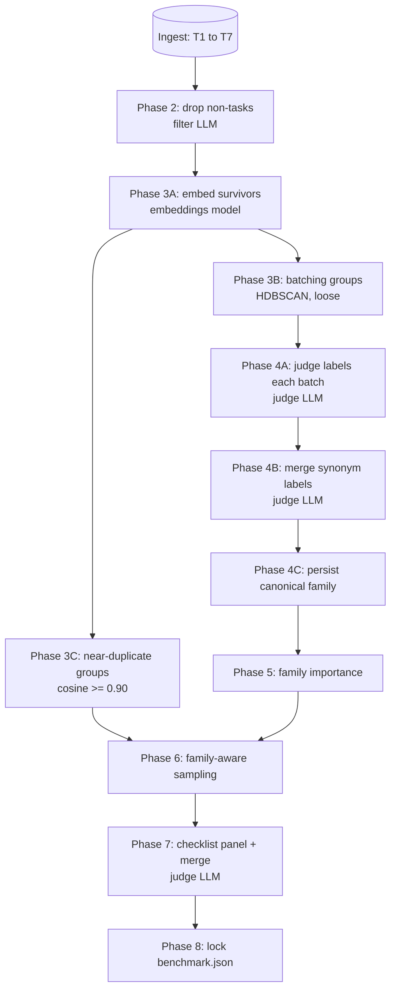

# EgoBench Pipeline Phases

This document is the end-to-end map of what EgoBench does, which models are involved, and what each step writes.

Model names below are the default examples from `egobench.toml`. The actual model used depends on the workspace config and CLI arguments.

## Walkthrough: a worked example through every phase

To make the pipeline concrete, the diagram and trace below follow a small set of ingested turns from raw input to locked benchmark.

Ingest delivers 7 user turns:

| Turn | First user message |
| --- | --- |
| T1 | `hi` |
| T2 | `write a python function to sort a list` |
| T3 | `write me a python sort function please` |
| T4 | `thanks!` |
| T5 | `explain être vs avoir in French` |
| T6 | `when do I use être or avoir` |
| T7 | `help me debug this React useEffect` |



Per-task trace, one column per turn:

| Phase | T1 | T2 | T3 | T4 | T5 | T6 | T7 |
| --- | --- | --- | --- | --- | --- | --- | --- |
| 2 filter | drop (greeting) | keep | keep | drop (ack) | keep | keep | keep |
| 3A embed | — | vector | vector | — | vector | vector | vector |
| 3B batching group | — | grp_A | grp_A | — | grp_B | grp_B | grp_A |
| 3C near-dup group | — | dup_X (0.94 vs T3) | dup_X | — | dup_Y (0.91 vs T6) | dup_Y | solo |
| 4A raw label | — | `Python sort helper` | `Python sorting fn` | — | `French grammar nuance` | `French grammar distinction` | `React hooks debug` |
| 4B canonical family | — | Python coding | Python coding | — | French grammar | French grammar | React debugging |
| 4C `task_family_id` | — | `python-coding-…` | `python-coding-…` | — | `french-grammar-…` | `french-grammar-…` | `react-debug-…` |
| 6 sample | — | pick | drop (dup of T2) | — | pick | drop (dup of T5) | pick |
| 7 rubric | — | drafted + merged | — | — | drafted + merged | — | drafted + merged |
| 8 in benchmark | — | yes | — | — | yes | — | yes |

Reading the trace, the things worth pausing on:

- **3B and 3C consume the same embeddings but do completely different jobs.** 3B groups T2, T3, and T7 into the same loose neighborhood because they are all software-help-ish, which gives the judge in 4A useful batch context. 3C, on the same vectors but with a much tighter 0.90 threshold, only groups T2 with T3 and T5 with T6, because those pairs are essentially paraphrases. Both run back-to-back inside phase 3 because the embedding vectors live only in memory there and are never persisted.
- **Phase 3C's output sits unused until phase 6.** `near_duplicate_group_id` is written in phase 3 but is not consumed until sampling three phases later, where it ensures the benchmark never contains two paraphrases of the same prompt.
- **4A produces freeform labels; 4B is what makes families stable.** The judge in 4A is free to phrase the same idea differently across batches (`Python sort helper` vs `Python sorting fn`). 4B sees every unique raw label and collapses synonyms into one canonical family, which 4C then writes to the DB.

The locked benchmark in phase 8 contains 3 tasks — T2, T5, T7 — one survivor per canonical family, with T3 and T6 suppressed as near-duplicates.

## Phase reference

The table below is the same flow as the diagram, but expanded with the model, inputs, and outputs of every step.

| Step | Command or phase | What happens | Model/API used | Reads | Writes |
| ---: | --- | --- | --- | --- | --- |
| 1 | `egobench init` | Creates the local workspace, default config, SQLite database, cache directory, and runs directory. | None | Nothing | `egobench-workspace/`, `egobench.toml`, `egobench.db` |
| 2 | `egobench ingest <path>` | Imports ChatGPT, Claude, or JSONL exports. Normalizes conversations and turns into SQLite. | None | Export file | `conversations`, `turns` tables |
| 3 | Build phase 2: Drop non-tasks | Looks only at the first user turn. Obvious non-tasks (empty messages, greetings, acknowledgments, pings) are dropped by heuristic at zero cost. All remaining candidates are sent concurrently to a cheap filter model with a single YES/NO question. Anything classified NO is dropped before phases 3–8 see any data. | `[filter]`, default `anthropic/claude-haiku-4-5-20251001`; deterministic heuristic fallback if the provider key is missing | `conversations`, `turns` | `task_candidates.is_task`, `task_candidates.first_user_text` |
| 4 | Build phase 3A: Embed task candidates | Embeds every task candidate that phase 2 kept. These vectors are reused by both the batching and near-duplicate steps below. | `[embeddings]`, default `openai/text-embedding-3-small`; deterministic heuristic fallback if the provider key is missing or embedding API fails | `task_candidates.first_user_text` | Embedding vectors in memory; cost log when a real embeddings API is called |
| 5 | Build phase 3B: Batching groups from embeddings | Uses HDBSCAN on embeddings when available, with a deterministic heuristic fallback. These groups exist only to batch roughly similar prompts together before asking the judge for semantic labels. They are not final benchmark families. | No LLM. Uses embeddings from step 4. | Embedding vectors | `candidate_group_id`, `candidate_group_size`; compatibility fields `cluster_id`, `cluster_size` |
| 6 | Build phase 3C: Near-duplicate suppression groups | Computes cosine similarity groups using `sample.near_duplicate_threshold`, default `0.90`. These groups are used later to avoid selecting many near-identical prompt variants into the final benchmark. | No LLM. Uses embeddings from step 4. | Embedding vectors | `near_duplicate_group_id`, `near_duplicate_group_size` |
| 7 | Build phase 4A: Batched task-family annotation | Sends chunks of up to 8 tasks from the same candidate group to the judge. The judge returns batch-level family context plus one annotation per task, including controlled `family_fit`, `difficulty`, and `specificity`. | `[judges.default]`, default `anthropic/claude-opus-4-7`; recorded fallback if key is missing | Candidate group prompts | Raw task-level family metadata in memory |
| 8 | Build phase 4B: Batched canonical family map | Sends unique raw family label strings to the judge in chunks of 120. The judge maps synonymous source labels to canonical family metadata in one response per chunk. | `[judges.default]`; falls back to treating missing or failed labels as their own canonical family | Raw task annotations | Canonical family mappings in memory |
| 9 | Build phase 4C: Persist canonical annotations | Applies the canonical family map to every task annotation and writes the stabilized family, domain, skills, difficulty, and specificity fields used downstream. | None | Raw task annotations and canonical family mappings | `task_family_id`, canonical `task_family`, `domain`, `skills_json`, `family_fit`, `difficulty`, `specificity` |
| 10 | Build phase 5: Family importance | Computes family size and importance from frequency, near-duplicate diversity, and difficulty mix. | None | Canonical family metadata and near-duplicate groups | `family_size`, `family_importance`; compatibility field `importance` |
| 11 | Build phase 6: Family-aware sampling | Selects final benchmark tasks. Picks at most one task per near-duplicate group, caps each family with `sample.max_family_tasks`, and reserves `sample.long_tail_fraction` for rare families. Ranks candidates by specificity and difficulty. | None | Family importance, specificity, difficulty, near-duplicate groups | `selected = 1` for chosen tasks |
| 12 | Build phase 7A: Checklist panel | Each panel model drafts rubric items for selected tasks in batches of 5. The prompt includes task family, domain, skills, difficulty, and specificity. | `[[judges.checklist_panel]]`, default `anthropic/claude-opus-4-7` and `openai/gpt-5`; recorded fallback if keys are missing | Selected tasks and family metadata | Raw checklist items in memory |
| 13 | Build phase 7B: Checklist merge | Merges and deduplicates panel checklist items into the final task rubric in batches of 5. | `[judges.default]` | Raw checklist items | `checklist_json`, `raw_checklists_json` |
| 14 | Build phase 8: Lock benchmark | Writes the final benchmark, versioned copy, metadata distributions, and reproducible hash. | None | Selected tasks, conversations, checklists, config | `benchmark.json`, `benchmark_vN.json`, `benchmark_versions` table |
| 15 | `egobench review` | Opens the local review UI for selected tasks. You can edit checklists and importance values, then relock the benchmark. | None | `benchmark.json`, SQLite DB | Updated checklist/importance fields, new benchmark version |
| 16 | `egobench eval --model <provider/model-id>` | Candidate model answers each benchmark task. The model is supplied on the CLI. | Candidate model from CLI, for example `openai/gpt-5`; recorded fallback if the provider key is missing | `benchmark.json` | `responses.jsonl`, task artifacts under `runs/` |
| 17 | Eval judging | Each judge scores every candidate answer against the task checklist; with a panel, per-judge scores are aggregated into one consensus score per task. | `[[judges.scoring_panel]]` if set, else `[judges.default]`; override with repeated `--judge provider/model-id` | Candidate response, task prompt, checklist | `scores.jsonl` (incl. `judge_scores`, `judge_spread`), `rationales.jsonl` (per-judge `judges`) |
| 18 | Eval summary | Computes raw EgoScore, frequency-weighted EgoScore, per-family/category means, run cost, and wall time. | None | Eval score rows and cost log | `summary.json` |
| 19 | `egobench report` and `egobench leaderboard` | Renders local reports and prints local run rankings. | None | Run summaries, task details, benchmark metadata | `report.html`, `report.md`, terminal leaderboard |

## Model Routing

The main model knobs are:

| Config or CLI field | Used for | Default example |
| --- | --- | --- |
| `[filter]` | Build phase 2 task/non-task classification | `anthropic/claude-haiku-4-5-20251001` |
| `[embeddings]` | Build phase 3 embeddings | `openai/text-embedding-3-small` |
| `[judges.default]` | Phase 4 batched family annotation and canonical mapping; phase 7 checklist merge; eval scoring when no panel is set | `anthropic/claude-opus-4-7` |
| `[[judges.checklist_panel]]` | Phase 7 batched checklist drafting panel | `anthropic/claude-opus-4-7`, `openai/gpt-5` |
| `[[judges.scoring_panel]]` | Eval scoring panel; per-judge scores aggregated per task (`scoring_aggregate` = `mean`/`median`) | unset → uses `[judges.default]` |
| `egobench eval --model provider/model-id` | Candidate model being benchmarked | User supplied |
| `egobench eval --judge provider/model-id` | Eval scoring judge(s); repeat for a panel; overrides config | User supplied |

If a provider declares `api_key_env` and that environment variable is missing, EgoBench uses the deterministic recorded fallback client. That is useful for tests and smoke runs, but it means no real model API is being called.

## Family Grouping

Task families are intentionally data-driven. EgoBench does not use a fixed topical taxonomy.

The easiest way to read the pipeline is to separate three different kinds of grouping:

1. **Batching groups**: rough embedding-based groups used only to give the judge local context.
2. **Near-duplicate groups**: high-similarity groups used only to suppress repeated variants later.
3. **Task families**: the final semantic families used by importance scoring, sampling, benchmark files, and reports.

Only the third one is the benchmark's actual family system.

The flow is:

1. **Phase 3A** embeds all task candidates.
2. **Phase 3B** turns embeddings into rough `candidate_group_id` batches. This is a mechanical pre-pass, not the final clustering of benchmark families. The grouping is intentionally loose: its only job is to give the judge coherent batches of related prompts in phase 4A so it can assign family labels consistently.
3. **Phase 3C** also turns embeddings into `near_duplicate_group_id` groups so repeated prompt variants can be suppressed later. The grouping here is intentionally tight (90% cosine similarity): its only job is to flag tasks that are essentially the same prompt rephrased, so phase 6 sampling picks at most one representative per group. A batch of 20 "Python programming" tasks might all land in the same 3B group for judge context, while only 2 of them — "write a Python sort function" and "write me a Python sort function please" — are close enough to share a 3C near-duplicate group.
4. **Phase 4A** sends chunks of up to 8 tasks from each batching group to the judge. The judge returns group context plus per-task `task_family`, `domain`, `skills`, `difficulty`, and `specificity` judgments, and may choose a better family for an individual task.
5. **Phase 4B** collects all unique raw label strings and sends them to the judge in chunks of 120. Labels that are semantically equivalent but worded differently, for example `Technical Concept Explanation` and `Concept Explanation`, can land in the same canonical family.
6. **Phase 4C** applies the canonical family map to every annotation and writes stable `task_family_id` values.
7. **Phase 5 and phase 6** group by `task_family_id`, not by raw label strings and not by `candidate_group_id`.
8. `task_family` remains the readable display label in benchmark files and reports.

This means labels like `French grammar distinction explanation` and `French grammar nuance explanation` are merged into one canonical family such as `French grammar explanation`.

## Important Outputs

Each benchmark task includes family metadata:

```json
{
  "task_family_id": "french-grammar-explanation-a1b2c3d4",
  "task_family": "French grammar explanation",
  "domain": "French language learning",
  "skills": ["grammar explanation", "translation nuance"],
  "difficulty": "medium",
  "specificity": "generalizable"
}
```

Benchmark metadata includes distribution summaries:

```json
{
  "task_count": 100,
  "task_family_count": 42,
  "domain_distribution": {},
  "family_distribution": {},
  "difficulty_distribution": {},
  "specificity_distribution": {}
}
```
